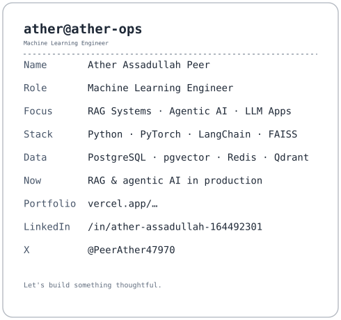

# Hi, I'm Ather Assadullah Peer

### Machine Learning Engineer · RAG Systems · Agentic AI · LLM Application Development
**Self-taught. Production-focused. Open to AI/ML Internships & Remote Roles.**

 

<table>
 <tr>
 <td align="center" valign="top">
 
 </td>
 <td align="center" valign="top">
 
 </td>
 </tr>
</table>

---

## About Me

Self-taught AI/ML engineer building **production RAG systems**, **agentic pipelines**, and **ML algorithms from mathematical first principles**. No shortcuts. No abstractions I haven't understood at the layer beneath.

- Shipped **Xpect AI** — a production RAG semantic search engine over 8,800+ titles — in **15 days**, concept to live deployment.
- Qualified in the **top 23% of 1,34,421 applicants** for **Amazon ML Summer School 2026** — cleared CV + SOP rounds with no college degree at time of application.
- Implement ML algorithms (gradient descent, backpropagation, ensemble methods) **from scratch in NumPy**, validated line-by-line against library implementations.
- Based in Bangalore, India — open to remote roles worldwide.

---

## What I Build

| Area | Details |
|---|---|
| **RAG Systems** | Production pipelines with ChromaDB, FAISS, SentenceTransformers, Gemini 2.5 Flash — sub-second retrieval at scale |
| **Agentic AI** | LangGraph, smolagents, ReAct agents, multi-agent orchestration, tool-use pipelines |
| **ML from Scratch** | Linear/Logistic Regression, Random Forest, XGBoost, Neural Networks — built in NumPy, benchmarked against Scikit-learn |
| **SQL & Databases** | Normalized schema design, JOINs, window functions, stored procedures, views, triggers (PostgreSQL) |
| **Full-Stack Deployment** | FastAPI backends, Streamlit Cloud, HuggingFace Spaces, AWS (EC2/S3/Lambda — in progress) |

---

## Featured Projects

### [Xpect AI](https://cinesense-ai-v1.streamlit.app) — Production RAG Application
Full end-to-end RAG pipeline over 8,800+ titles — sentence chunking, batch vector embedding, persistent ChromaDB storage, and a Gemini 2.5 Flash generation layer constrained to retrieved context to eliminate hallucinations. FastAPI backend + Streamlit chat UI with mood/genre filters.
`Python` `ChromaDB` `SentenceTransformers` `Gemini 2.5 Flash` `FastAPI` `Streamlit`

### [Atlas Agent](https://github.com/ather-ops/atlas-agent) — Autonomous AI Assistant
Multi-step autonomous assistant built with smolagents — reasons through goals, invokes external tools (web search, RAG retrieval, code execution, weather API), and completes tasks with minimal supervision.
`smolagents` `LangGraph` `HuggingFace` `Gradio`

### [Hospital Management SQL](https://github.com/ather-ops/Hospital-Management-SQL) — Database Engineering
Fully normalized relational schema (patients, doctors, appointments, treatments, billing) with complex JOINs, window functions, stored procedures, views, and triggers for operational reporting.
`SQL` `PostgreSQL` `Python`

### [Cafe Sales Analysis](https://github.com/ather-ops) — Data Cleaning & EDA
End-to-end cleaning of a 10,000-row real-world-messy dataset, followed by feature engineering, outlier detection, and EDA translating raw transactions into business insights.
`Python` `Pandas` `NumPy` `Matplotlib`

### [ML Algorithms from Mathematical Foundations](https://github.com/ather-ops)
Linear/Logistic Regression, Random Forest, and XGBoost implemented entirely from scratch — zero Scikit-learn — validating forward/backward propagation and gradient math by hand.
`Python` `NumPy` `Pandas`

---

## Currently

- DSA — GFG full course (Arrays through Dynamic Programming)
- Supervised ML — implementing every algorithm from scratch
- AWS deployment pipelines (EC2, S3, Lambda)
- LangGraph multi-agent systems
- System Design — HLD/LLD for FAANG-track interviews

---

## Tech Stack

**RAG & LLM:** ChromaDB · FAISS · Gemini 2.5 Flash · SentenceTransformers · Prompt Engineering · Cosine Similarity
**Agentic AI:** LangGraph · smolagents · ReAct Agents · Multi-Agent Orchestration
**Also:** Neural Networks · XGBoost · Random Forest · GROQ · Gradio · Vercel

---

## GitHub Stats

---

## Recent Activity

<!-- Live contribution graph, refreshed daily by GitHub Actions -->

 

## Key Achievements

- **Amazon ML Summer School 2026** — Top 23% of 1,34,421 applicants nationwide (CV + SOP rounds), without a college degree at time of application
- **Xpect AI shipped in 15 days** — full vector pipeline, LLM integration, FastAPI backend, live Streamlit Cloud deployment
- **Tata Group Data Analytics Job Simulation (Forage)** — AI-powered EDA and agentic AI collections strategy design for Tata iQ Financial Services
- Self-taught trajectory from zero ML knowledge to production RAG + agentic AI systems within months, no formal CS background

---

### What I Bring to a Team

**Production Velocity** · Shipped a full RAG system in 15 days, zero to live
**Mathematical Depth** · ML algorithms and gradient math implemented in NumPy, no shortcuts
**Agentic AI Focus** · Actively building LangGraph and smolagents pipelines
**Remote Discipline** · Daily commits, written-first communication, no-supervision-required execution

 

**peerather07@gmail.com** · Bangalore, India · Open to Remote

